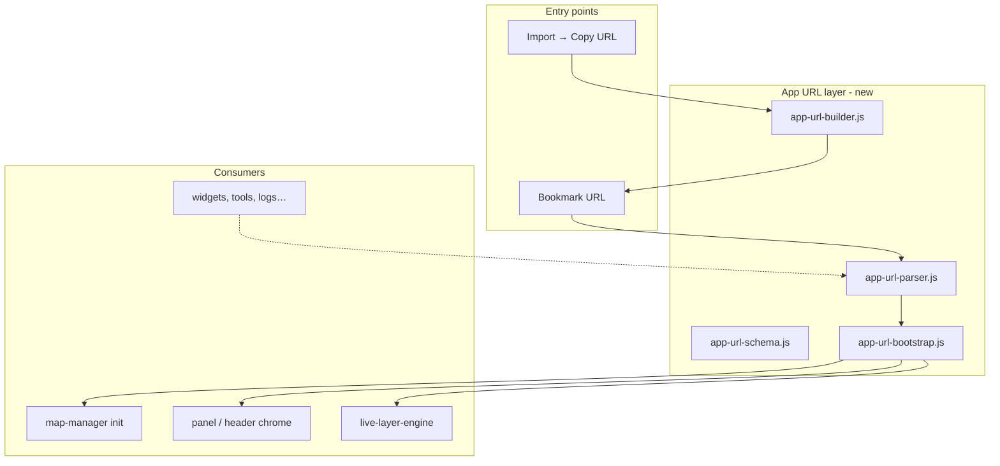

# Live Map & App URL Config — Feature Plan

> **Status:** Planned — not yet implemented.  
> Use this document when resuming work (with an agent or solo). Commit on `staging`; implement in the order below.

## Overview

Build **app-wide bookmarkable URL configuration** (viewport, extent, pitch, heading, 2D/3D, basemap, panel chrome) plus **live/service layer maps** (WMS, ArcGIS MapServer, WFS, FeatureServer, GeoJSON feeds).

Delivered as a **Live Map widget** (Import entry) with **Prebuilt maps** and **Custom URL** tabs. New prebuilt options are **data-only catalog entries**; developers capture preset JSON from the app and paste into the catalog.

---

## Implementation checklist

- [ ] **url-infrastructure** — Create `js/url/` modules (schema, parser, builder, bootstrap) for app-wide URL config
- [ ] **url-chrome-apply** — Wire URL bootstrap into `App.jsx` and `map-manager` init; panel collapse, basemap, dimension, viewport before session restore
- [ ] **catalog-schema** — Declarative `js/live-layers/catalog.js` + schema + kind inference (new prebuilts = catalog edits only)
- [ ] **service-layer-model** — Add `type: 'service'` to data-model, state, layer-info, session-store, layer-restore
- [ ] **map-rendering** — `live-layer-engine` + map-manager service layer methods (WMS, ArcGIS raster, vector refresh)
- [ ] **url-live-integration** — `map` / `live` URL params; live-layer bootstrap as URL consumer
- [ ] **live-map-widget** — Widget (engine/controller/dialog); Import card; Prebuilt + Custom URL tabs
- [ ] **persistence-polish** — Project kit service layers, `docs/LIVE_MAP_PRESETS.md` authoring guide, catalog tests, CSS

---

## Context

Today GIS Toolbox has **no general URL configuration** for the main editor. The only query-string handling is presentation mode (`?mode=present&scene=…`) in [`js/presentation/presentation-mode-detector.js`](../js/presentation/presentation-mode-detector.js). WMS/WFS are **not implemented**; ArcGIS import is **download-only** ([`js/arcgis/rest-importer.js`](../js/arcgis/rest-importer.js)).

This build has **two coupled parts**:

1. **App-wide URL infrastructure** — bookmarkable control of map view, 2D/3D, basemap, panel chrome, and (later) other app state.
2. **Live layer maps** — catalog-driven streaming/service layers + Live Map widget, consuming the URL system for `?map=` / `?live=` presets.



---

## Part A — App-wide URL infrastructure

### A.1 New module: `js/url/`

Centralize all non-presentation URL handling here. Presentation mode stays in its existing module but can share low-level helpers where useful.

| File | Role |
|------|------|
| [`js/url/app-url-schema.js`](../js/url/app-url-schema.js) | Param definitions, validation, defaults, allowed values |
| [`js/url/app-url-parser.js`](../js/url/app-url-parser.js) | `parseAppUrl(search) → AppUrlConfig` |
| [`js/url/app-url-builder.js`](../js/url/app-url-builder.js) | `buildAppUrl(config, baseUrl?) → string` |
| [`js/url/app-url-detector.js`](../js/url/app-url-detector.js) | Early boot detection: `hasAppUrlConfig()`, `getAppUrlConfig()` |
| [`js/url/app-url-bootstrap.js`](../js/url/app-url-bootstrap.js) | Orchestrator: apply config in correct order after map ready |

**Design principles:**

- **Human-readable params** over opaque blobs (unlike presentation `scene=` encoding).
- **Composable** — each param is independent; omit any param to use app defaults.
- **Extensible** — new params register in schema without rewriting bootstrap.
- **Single builder** — all "Copy URL" actions use `buildAppUrl()`.

### A.2 URL parameter schema (v1)

#### Camera & extent (full map view control)

Two equivalent ways to specify the map view — use **either** compact `view`/`bounds` **or** discrete params (discrete wins if both present).

**Option 1 — Compact `view` param** (center + zoom + optional pitch/heading):

| Format | Example | Fields |
|--------|---------|--------|
| Basic | `?view=7,-111.09,39.32` | `zoom,lng,lat` |
| Full camera | `?view=7,-111.09,39.32,45,120` | `zoom,lng,lat,pitch,bearing` |

- `pitch` — degrees (0 = flat, 60 = steep; useful with `dim=3d`)
- `bearing` — map heading in degrees clockwise from north (alias `heading` in discrete params)

**Option 2 — Extent / bounding box** (fit map to an area instead of center+zoom):

| Param | Example | Format |
|-------|---------|--------|
| `bounds` | `?bounds=-112.1,39.5,-111.0,40.5` | `west,south,east,north` (WGS84 degrees) |
| `bounds` + padding | `?bounds=-112.1,39.5,-111.0,40.5&padding=40` | Optional `padding` px (default 30) |

When `bounds` is set, bootstrap calls `map.fitBounds()`. Optional `pitch` and `bearing`/`heading` apply after fit via `map.jumpTo()`.

**Option 3 — Discrete params** (hand-edited bookmarks):

| Param | Example | Notes |
|-------|---------|-------|
| `lng`, `lat` | `?lng=-111.09&lat=39.32` | Center (both required together) |
| `zoom` | `?zoom=7` | Zoom level |
| `pitch` | `?pitch=45` | Tilt in degrees |
| `bearing` or `heading` | `?bearing=120` | Map rotation / heading |
| `padding` | `?padding=40` | Used with `bounds` only |

**Precedence:** `bounds` > `view` > discrete `lng/lat/zoom`. Pitch and heading apply regardless of position mode.

#### App chrome & layers

| Param | Example | Values | Applies to |
|-------|---------|--------|------------|
| `basemap` | `?basemap=satellite` | `voyager`, `satellite` (from map-manager BASEMAPS) | Basemap |
| `dim` | `?dim=3d` | `2d` \| `3d` (also `3d=1` / `3d=0`) | 2D vs 3D terrain |
| `panel` | `?panel=both` | `both` \| `left` \| `right` \| `none` | Side panels expanded on load |
| `map` | `?map=utah-wildfire-watch` | Live map preset id | Layers + default chrome from preset |
| `live` | `?live=nifc-perimeters,nws-radar` | Comma-separated live layer ids | Individual service layers |

**Panel param semantics:**

| Value | Left panel | Right panel |
|-------|------------|-------------|
| `both` (default) | expanded | expanded |
| `left` | expanded | collapsed |
| `right` | collapsed | expanded |
| `none` | collapsed | collapsed |

Future v2 params (schema-ready): `tool=`, `widget=`, `logs=1`, `fence=1`.

**Example bookmark URLs:**

```
?map=utah-wildfire-watch&panel=none&dim=3d
?live=udot-traffic-speeds&basemap=satellite&view=8,-111.5,40.2,0,0&panel=right&dim=2d
?basemap=voyager&bounds=-112.1,39.5,-111.0,40.5&pitch=30&bearing=45&dim=3d&panel=none
?lng=-111.09&lat=39.32&zoom=7&pitch=45&heading=120&basemap=satellite
```

### A.3 Bootstrap flow & precedence

**Precedence rules:**

1. `?mode=present` — exclusive; no app-url bootstrap.
2. Any recognized app-url param present — URL config wins; **skip session-restore prompt**.
3. No URL params — normal boot + session restore.

**Apply order** (in `app-url-bootstrap.js` after `map:ready`):

1. Basemap
2. Dimension (2D/3D)
3. Viewport (`fitBounds` or `jumpTo` with pitch/bearing)
4. Panels (`setPanelCollapsed`)
5. Live layers (live-layer-engine)

**Map init early apply:** Generalize `presentationInit` in [`map-manager.js`](../js/map/map-manager.js) `init()` to accept `urlInit` `{ center, zoom, pitch, bearing, bounds, padding, basemap, enable3D }`. Defer `bounds` fit to post-load `fitBounds`.

### A.4 URL builder API

```javascript
buildAppUrl({
  view: { zoom, center: [lng, lat], pitch, bearing },
  bounds: [west, south, east, north],
  padding: 30,
  basemap: 'satellite',
  dim: '3d',
  panel: 'none',
  map: 'utah-wildfire-watch',
  live: ['nifc-perimeters', 'nws-radar']
}, baseUrl?)

captureAppUrlFromMap(map, { mode: 'center' | 'bounds', includeChrome: true })
```

### A.5 Panel state fix (prerequisite)

[`usePanelCollapse`](../react/App.jsx) must accept initial collapsed state from URL config and stay in sync with `setPanelCollapsed()` in [`tool-handlers.js`](../js/tools/tool-handlers.js).

### A.6 Tests

New [`tests/app-url.test.js`](../tests/app-url.test.js): parse/build round-trip, camera modes, bounds precedence, invalid fallbacks, presentation mode exclusion.

---

## Part B — Live layer maps

### B.1 Data model: `type: 'service'`

Extend [`js/core/data-model.js`](../js/core/data-model.js) with `createServiceLayer()`:

```javascript
{
  id, name, type: 'service', visible: true,
  service: {
    presetId: 'nifc-active-fires',
    kind: 'wms' | 'arcgis-mapserver' | 'wfs' | 'arcgis-featureserver' | 'geojson-feed',
    url, layers, params,
    refreshMs: 300000,
    style: { /* vector kinds */ },
    opacity: 0.75,
    attribution: '…'
  },
  source: { format: 'live-service', presetId, url }
}
```

### B.2 Rendering & refresh engine

New [`js/live-layers/live-layer-engine.js`](../js/live-layers/live-layer-engine.js):

| Kind | MapLibre approach | Refresh |
|------|-------------------|---------|
| **wms** | `raster` source, GetMap tile template | Cache-bust on `refreshMs` |
| **arcgis-mapserver** | Tile or export image raster | Cache-bust on `refreshMs` |
| **wfs** | GeoJSON for viewport bbox | `moveend` + `refreshMs` |
| **arcgis-featureserver** | Envelope query | `moveend` + `refreshMs` |
| **geojson-feed** | `fetch` → GeoJSON | `refreshMs` timer |

### B.3 Declarative preset catalog — data-only authoring

**Goal:** New prebuilt maps = one catalog entry only. Provide **name**, **layer URL(s)**, and **map view/customizations**.

[`js/live-layers/catalog.js`](../js/live-layers/catalog.js) — single source of truth (pattern: [`js/arcgis/endpoints.js`](../js/arcgis/endpoints.js)).

**`LIVE_MAP_PRESETS`** example:

```javascript
{
  id: 'utah-wildfire-watch',
  name: 'Utah Wildfire Watch',
  description: '…',
  region: 'utah',
  category: 'Wildfire',
  layers: [
    'nws-radar',
    { name: 'Active Fire Perimeters', url: 'https://…/FeatureServer/0' }
  ],
  basemap: 'satellite',
  dim: '2d',
  panel: 'none',
  viewport: {
    center: [-111.5, 39.5],
    zoom: 6,
    pitch: 0,
    bearing: 0
    // OR bounds: [west, south, east, north], padding: 30
  }
}
```

**Catalog schema helpers** ([`catalog-schema.js`](../js/live-layers/catalog-schema.js)):

| Helper | Behavior |
|--------|----------|
| `inferServiceKind(url)` | Detect WMS, ArcGIS, WFS, GeoJSON from URL |
| `resolveMapPreset(id)` | Full AppUrlConfig + layer configs |
| `presetToAppUrlConfig(preset)` | Preset → URL builder input |
| `appUrlConfigToCatalogPreset(config, meta)` | Reverse: config → catalog JSON (developer export) |
| `captureAppUrlFromMap(map, chrome)` | Snapshot map + chrome → AppUrlConfig |
| `validateCatalog()` | Duplicate ids, bad refs, tests |

**Seed preset ideas** (verify URLs at implementation): Utah traffic/cameras, NIFC fires, NWS weather, USGS earthquakes, OpenSky aviation.

### B.4 Live layers as URL consumer

[`js/live-layers/live-layer-bootstrap.js`](../js/live-layers/live-layer-bootstrap.js) — `applyLiveLayerConfig()` called from `app-url-bootstrap.js`.

---

## Part C — Live Map widget (Import entry)

Built as a **GIS Widget** per [`WIDGET_AGENT_PLAYBOOK.md`](WIDGET_AGENT_PLAYBOOK.md). Import is the entry point; use engine → controller → React dialog → registry.

### File layout

```
js/widgets/live-map/
  engine.js
  controller.js

react/widgets/
  LiveMapDialog.jsx
  mountLiveMapDialog.jsx

js/live-layers/
  catalog.js
  catalog-schema.js
  live-layer-engine.js

js/widgets/registry.js  → GIS_WIDGETS_HIDDEN (Import-only)
```

| Trigger | Wiring |
|---------|--------|
| Import card | [`ImportFlowDialog.jsx`](../react/tools/ImportFlowDialog.jsx) → `onOpenLiveMap` |
| Open widget | [`tool-handlers.js`](../js/tools/tool-handlers.js) → `openLiveMap()` |
| Modal | [`open-react-island.js`](../js/ui/open-react-island.js) + DockedWidgetModal |

Reference widgets: [`presentation-link-builder`](../js/widgets/presentation-link-builder/), [`spatial-analyzer`](../js/widgets/spatial-analyzer/).

### Dialog UX — two tabs

**Tab 1 — Prebuilt maps**

- Data-driven from `LIVE_MAP_PRESETS` + `LIVE_LAYERS`
- **Add to map** / **Copy URL** (`?map=preset-id`)

**Tab 2 — Custom URL**

- Layer picker + custom URL rows, basemap, 2D/3D, panels, view/bounds, pitch, heading
- **Use current map view** — capture from live map
- Live URL preview, **Copy URL**, **Add to map**
- **Copy catalog entry** — developer export JSON for new prebuilts

Custom URLs use `?live=…&basemap=…&view=…` (not `?map=`, reserved for catalog slugs).

---

## Part D — Integration touchpoints

- [`js/core/state.js`](../js/core/state.js), [`layer-restore.js`](../js/core/layer-restore.js), [`session-store.js`](../js/core/session-store.js)
- [`js/map/map-service.js`](../js/map/map-service.js) — service layer delegates
- [`js/core/project-kit.js`](../js/core/project-kit.js) — export/import service records
- [`css/main.css`](../css/main.css) — `.live-map-dialog__*`

---

## Implementation order

1. App URL schema + parser + builder + tests
2. URL bootstrap + map init `urlInit` + panel fix
3. Live layer catalog + service data model
4. Map rendering + refresh engine
5. Live layer URL consumer + bootstrap hook
6. Live Map widget + Import card + Custom URL tab
7. Developer export preset JSON + session/kit polish + `LIVE_MAP_PRESETS.md` authoring guide

---

## Risks & mitigations

- **External feed reliability** — graceful errors; easy catalog edits
- **CORS** — prefer CORS-enabled endpoints; document failures
- **Panel React/DOM sync** — fix `usePanelCollapse` initial state from URL
- **Session vs URL** — skip restore when app-url params present
- **Param conflicts** — explicit URL params override preset defaults

---

## Out of scope for v1

- WMS time-dimension animation
- Server-side URL shortener
- Full workspace URL with local GeoJSON layers (use Toolbox Kit)
- Auto-sync URL bar on every map change
- Left-panel widget button (Import-only via `GIS_WIDGETS_HIDDEN`)

---

## Workflows after build

### End user — custom bookmark

Import → Live Map → Custom URL → configure → Copy URL or Add to map.

### End user — prebuilt map

Import → Live Map → Prebuilt maps → Add to map / Copy URL, or open `?map=preset-id`.

### Developer — add a new prebuilt

1. Configure map in the app.
2. Live Map → Custom URL → **Use current map view** → **Copy catalog entry**.
3. Append JSON to [`js/live-layers/catalog.js`](../js/live-layers/catalog.js) (or give JSON to an agent).

Example agent request:

> Add this catalog entry: `{ … pasted JSON … }`

---

## Related docs

- Widget build process: [`WIDGET_AGENT_PLAYBOOK.md`](WIDGET_AGENT_PLAYBOOK.md), [`WIDGET_AUTHORING.md`](WIDGET_AUTHORING.md)
- Git workflow: [`DEVELOPMENT.md`](DEVELOPMENT.md), [`AGENTS.md`](../AGENTS.md)
- Post-build catalog authoring (to create during implementation): `LIVE_MAP_PRESETS.md`
